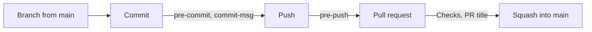

# 🤝 Contributing

> How changes are written and how they move into this repository: the rules every change follows, and the checks that hold them.

## 🌳 Table of contents

- [🎨 Code style](#-code-style)
- [🌿 Git workflow](#-git-workflow)
  - [Branches](#branches)
  - [Commits](#commits)
  - [Git hooks](#git-hooks)
  - [Continuous integration](#continuous-integration)
  - [Pull requests](#pull-requests)
  - [Repository settings](#repository-settings)

## 🎨 Code style

The full standard lives in [`docs/conventions/`](docs/conventions/README.md), one document per topic, each with bad and good examples and a table of the checks that enforce it:

| Document                                        | Covers                                                                                                     |
| ----------------------------------------------- | ---------------------------------------------------------------------------------------------------------- |
| [code-style.md](docs/conventions/code-style.md) | TypeScript: files and exports, naming, functions, control flow, SOLID, spacing, types, imports, formatting |
| [comments.md](docs/conventions/comments.md)     | When a comment earns its place, its shape, and the comment check                                           |
| [react.md](docs/conventions/react.md)           | React and Next.js: components, props, hooks, state, composition, data fetching, styling, accessibility     |

Where code lives is decided by Feature-Sliced Design, described in [`docs/architecture/feature-sliced-design.md`](docs/architecture/feature-sliced-design.md).

The rules in short:

- **Arrow functions everywhere**, Next.js route files included, exported by name. Default exports only in route files and tool config files.
- **Guard clauses instead of nesting.** Handle the early exits first, one line each, then write the main path flat.
- **Lookup maps instead of `switch`**, typed with `satisfies Record<Union, Value>` so a missing case fails the build. No `else if` chains and no nested ternaries.
- **One responsibility per unit.** A component renders, its hook (in `model/`) holds state and handlers, pure functions live in `lib/`, named data in `config/`, requests in `api/`.
- **Code breathes.** A blank line between steps, before every `return` and after every block.
- **No comment by default.** A comment carries a reason the code cannot: never a restatement, a file path, a ticket number or commented-out code.
- **Server Components by default.** `"use client"` goes on the smallest leaf that needs it; independent requests run in parallel.
- **Props extend the root element's props**, forward `...props` and compose `className`; behavior variants come from composition, not boolean props.
- **Descriptive names**: `event`, not `e`; booleans read as questions (`isOpen`, `hasItems`).

Tools enforce what they can, so run them before you push:

| Command              | Checks                                                                                                       |
| -------------------- | ------------------------------------------------------------------------------------------------------------ |
| `pnpm lint`          | ESLint (the rules in the Enforcement tables of each convention document) and Steiger (Feature-Sliced Design) |
| `pnpm lint:comments` | Comment citations, one-line block comments and lint directives fail; comment density and shape are reported  |
| `pnpm format`        | Prettier formatting                                                                                          |
| `pnpm types:check`   | TypeScript in strict mode                                                                                    |
| `pnpm test`          | Vitest                                                                                                       |
| `pnpm spell:check`   | cspell, over code and docs                                                                                   |
| `pnpm lint:md`       | markdownlint, over every Markdown file                                                                       |

`pnpm lint:fix` and `pnpm format:fix` apply the fixes the tools can make on their own. `pnpm lint:arch` runs only Steiger. To add a word to the spelling dictionary, edit [`tooling/cspell/project-words.txt`](tooling/cspell/project-words.txt).

Inline lint suppressions are switched off. If a rule does not fit a file, change the configuration for that file's glob and write down why.

## 🌿 Git workflow

`main` is always releasable. Every change starts on a short-lived branch and reaches `main` through a pull request, squashed into a single commit in the [commit convention](#commits). The checks from the table above run twice before that: as git hooks on your machine, and in CI on the pull request.



### Branches

GitHub Flow: `main` is the only long-lived branch. Create each branch from an up-to-date `main`, keep it small enough to review in one sitting, and delete it after the merge.

| Branch name             | When                                   | Examples                                      |
| ----------------------- | -------------------------------------- | --------------------------------------------- |
| `<type>/<issue>-<slug>` | The work has an issue                  | `feat/12-settings-page`, `fix/31-header-wrap` |
| `<type>/<slug>`         | The work has no issue, such as a chore | `chore/tidy-scripts`, `docs/deploy-guide`     |

The type is a commit type from the [next section](#commits) and the slug is kebab-case. When there is an issue, let GitHub create the branch, so the issue links to it from the first moment and shows the work as started:

```bash
gh issue develop 12 --name feat/12-settings-page --base main --checkout
```

A branch without an issue is an ordinary `git switch --create chore/tidy-scripts`. Two `pre-push` checks look at the branch, described in [Git hooks](#git-hooks): `linked` stops the first push of an issue branch that GitHub has not linked, and `scope` reports a branch that mixes unrelated changes.

To bring in new work from `main`, either rebase onto it or merge it into the branch. The branch is squashed when it merges, so its own history is never kept.

### Commits

Every commit subject has one shape, `type(scope): <gitmoji> Message`, built on [Conventional Commits](https://www.conventionalcommits.org/en/v1.0.0/) with a [gitmoji](https://gitmoji.dev) after the colon. commitlint checks it in the `commit-msg` hook, with the rules in [`commitlint.config.mjs`](commitlint.config.mjs) and [`tooling/scripts/commit-rules.mjs`](tooling/scripts/commit-rules.mjs):

```text
feat(web): ✨ Add the settings page

Optional body: why the change was made, after a blank line.
```

| Rule             | Detail                                                                                                                                      |
| ---------------- | ------------------------------------------------------------------------------------------------------------------------------------------- |
| **Type**         | One of the types in the next table, in lower case                                                                                           |
| **Scope**        | Required, in kebab-case, and general rather than specific: the package or area the change touches, such as `web`, `ui`, `tooling` or `repo` |
| **Gitmoji**      | Required, right after the colon and a space: the emoji itself or its `:code:`, then a space                                                 |
| **First letter** | Upper case                                                                                                                                  |
| **First word**   | A verb in the imperative. Forms such as `Added`, `Adding` or `Adds`, and openers such as `The` or `New`, are rejected                       |
| **Message**      | None of ``( ) , - ' " ` ;``, and no final period                                                                                            |
| **Length**       | 50 characters for the whole first line, counted in code points: an emoji with a variation selector, such as ♻️, counts as two               |
| **Body**         | Only when the subject cannot carry the reason, separated from it by a blank line                                                            |
| **Trailers**     | No `Co-authored-by`: authorship belongs in the commit author field                                                                          |

| Type       | For                                                       | Common gitmoji                                                   |
| ---------- | --------------------------------------------------------- | ---------------------------------------------------------------- |
| `feat`     | A new capability                                          | ✨ feature, 🚸 user experience, ♿️ accessibility, 🌐 translation |
| `fix`      | A bug fix                                                 | 🐛 bug, 🩹 small fix, 🚑️ urgent fix, 🔒️ security                 |
| `docs`     | Documentation only                                        | 📝                                                               |
| `style`    | Formatting that does not change what the code does        | 🎨 code layout, 💄 visual styles                                 |
| `refactor` | A code change that neither fixes a bug nor adds a feature | ♻️ refactor, 🔥 removal, 🚚 move or rename                       |
| `perf`     | A performance improvement                                 | ⚡️                                                               |
| `test`     | Tests only                                                | ✅                                                               |
| `build`    | Dependencies, the build and the tooling packages          | 🔧 config, 📦️ build, ⬆️ upgrade, ➕ add, ➖ remove, 📌 pin       |
| `ci`       | The GitHub workflows                                      | 👷 workflow, 💚 fix the build                                    |
| `chore`    | Other maintenance that ships no code                      | 🔨 scripts, 🙈 ignore files, 🧑‍💻 developer experience             |
| `revert`   | Undoing an earlier commit                                 | ⏪️                                                               |

Any emoji passes the check; the column lists the usual gitmoji so the history reads the same everywhere. A breaking change takes 💥 and a `BREAKING CHANGE:` footer in the body, since `!` after the scope does not fit the shape.

| Message                                                        | Result                              |
| -------------------------------------------------------------- | ----------------------------------- |
| `feat(web): ✨ Add the settings page`                          | ✅                                  |
| `build(deps): ⬆️ Bump Next.js to 16.4`                         | ✅                                  |
| `chore(repo): :wrench: Tune the editor config`                 | ✅ a `:code:` in place of the emoji |
| `feat(web): add the settings page`                             | ❌ no gitmoji                       |
| `feat: ✨ Add the settings page`                               | ❌ no scope                         |
| `feat(web): ✨ add the settings page`                          | ❌ lower case after the gitmoji     |
| `feat(web): ✨ Added the settings page`                        | ❌ not an instruction               |
| `feat(web): ✨ Add the read-only page.`                        | ❌ a hyphen and a final period      |
| `fix(web): 🐛 Keep the header on one line when the menu opens` | ❌ 59 characters                    |

Messages that git writes itself skip the shape rules, because git chose that wording: merge commits, the `Revert "…"` and `Reapply "…"` messages of `git revert`, and `fixup!`, `squash!` and `amend!` commits, so `git commit --fixup` works as usual. The `Co-authored-by` rule is not one they skip. To try a message without committing, pipe it in:

```bash
printf '%s\n' "feat(web): ✨ Add the settings page" | pnpm exec commitlint
```

### Git hooks

[lefthook](https://lefthook.dev) runs the hooks defined in [`lefthook.yml`](lefthook.yml). `pnpm install` installs them through the postinstall script of lefthook, which pnpm runs because `allowBuilds` in [`pnpm-workspace.yaml`](pnpm-workspace.yaml) lists it. The script does nothing when the `CI` variable is set.

| Hook         | Job            | Checks                                   | Runs when                   |
| ------------ | -------------- | ---------------------------------------- | --------------------------- |
| `pre-commit` | `eslint`       | ESLint on the staged files               | A JS or TS file is staged   |
| `pre-commit` | `comments`     | `pnpm lint:comments` on the staged files | A JS or TS file is staged   |
| `pre-commit` | `prettier`     | `prettier --check` on the staged files   | Always                      |
| `pre-commit` | `spelling`     | cspell on the staged files               | Always                      |
| `pre-commit` | `markdown`     | `pnpm lint:md`, over every Markdown file | A Markdown file is staged   |
| `pre-commit` | `types`        | `pnpm types:check`                       | A TS or JSON file is staged |
| `commit-msg` | `commitlint`   | The commit message                       | Always                      |
| `pre-push`   | `tests`        | `pnpm test`                              | Always                      |
| `pre-push`   | `architecture` | `pnpm lint:arch` (Steiger)               | Always                      |

On the empty template, a commit spends about 2 seconds in its hooks and a push about 2 seconds, or under half a second when Turborepo already holds the results. Jobs in the same hook run in parallel, and `types`, `tests` and `architecture` only redo the packages whose files changed.

- **The hooks check, they never rewrite.** When one fails, run `pnpm format:fix` or `pnpm lint:fix`, or fix the file by hand, then stage it and commit again.
- **They check what you staged.** While `pre-commit` runs, lefthook hides the unstaged part of a partially staged file. `types`, `tests` and `architecture` read whole projects from disk, so unstaged changes in other files still count.
- **Markdown is linted as a whole.** markdownlint-cli2 reads a file argument as a glob, so a staged path inside a Next.js folder such as `[slug]` or `(group)` would match nothing.
- **Missing hooks.** If `ls .git/hooks` shows only `*.sample` files, run `pnpm exec lefthook install`. A `pnpm install` with nothing new to install does not run the postinstall script again.

> [!IMPORTANT]
> `LEFTHOOK=0 git commit ...` skips every hook for one command, and `LEFTHOOK_EXCLUDE=types,tests git push` skips only the jobs it names. Skipping is fine for a work-in-progress commit on your own branch that the squash will fold away, or while a tool is broken on your machine and you are fixing it. It is never a way to get a failing check past review: CI runs the same checks, and with the [ruleset](#repository-settings) on `main` it blocks the merge, so a skipped hook only moves the failure later. If commits in a pull request skipped a hook, say so in its description.

### Continuous integration

Two workflows in [`.github/workflows/`](.github/workflows), both on the Node.js version in [`.nvmrc`](.nvmrc) and the pnpm version that `packageManager` names in [`package.json`](package.json):

| Workflow       | Job        | Runs on                                              | Checks                                                                                                              |
| -------------- | ---------- | ---------------------------------------------------- | ------------------------------------------------------------------------------------------------------------------- |
| `ci.yml`       | `Checks`   | Every pull request and every push to `main`          | `pnpm format`, `lint` (with `lint:arch`), `lint:comments`, `types:check`, `test`, `spell:check`, `lint:md`, `build` |
| `pr-title.yml` | `PR title` | A pull request opened, edited, reopened or pushed to | The pull request title, with commitlint                                                                             |

- **Every check runs even after one fails**, so a single run lists every problem, and the job still fails.
- **Caches**: the pnpm store and the Turborepo cache are restored between runs, so packages that did not change replay their results.
- **Secrets are optional.** The build reads `NEXT_PUBLIC_CLERK_PUBLISHABLE_KEY` and `CLERK_SECRET_KEY` from the repository secrets (Settings → Secrets and variables → Actions). Without them, as in a pull request from a fork, both are empty strings.
- **Pinned actions.** Each action is pinned to a commit SHA, with its version in a comment; Dependabot opens one pull request a month to update them.

### Pull requests

1. Push the branch and open a pull request against `main`, for example with `gh pr create --base main`.
2. Write the title as a commit message: it becomes the squash commit on `main`, and the `PR title` check holds it to the same rules.
3. Fill in the template: what changes, how you verified it, and the checklist.
4. Once `Checks` and `PR title` pass and the review is done, use **Squash and merge**. The branch is deleted after the merge.

One pull request carries one change. Open it as a draft when you want early feedback.

### Repository settings

A repository created from this template does not copy the settings of this one. Set these once, as an administrator:

| Setting                         | Where                                      | Value                                                                                                                 |
| ------------------------------- | ------------------------------------------ | --------------------------------------------------------------------------------------------------------------------- |
| Merge methods                   | Settings → General → Pull Requests         | Only **Allow squash merging**, with the default message **Pull request title and commit details**                     |
| Branch cleanup                  | Settings → General → Pull Requests         | **Automatically delete head branches**                                                                                |
| Branch ruleset for `main`       | Settings → Rules → Rulesets                | Require a pull request, require the status checks `Checks` and `PR title`, block force pushes, require linear history |
| Clerk keys, when auth is set up | Settings → Secrets and variables → Actions | `NEXT_PUBLIC_CLERK_PUBLISHABLE_KEY` and `CLERK_SECRET_KEY`                                                            |

The first two in one command, run from a clone of the new repository:

```bash
gh repo edit --enable-squash-merge --squash-merge-commit-message pr-title-commits \
  --enable-merge-commit=false --enable-rebase-merge=false --delete-branch-on-merge
```
