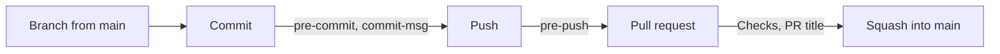

# 🤝 Contributing

> How changes are written and how they move into this repository: the rules every change follows, and the checks that hold them.

## 🧭 Table of contents

- [🎨 Code style](#-code-style)
- [🔁 How work moves](#-how-work-moves)
  - [The flow](#the-flow)
  - [Issues](#issues)
  - [Where the plan lives](#where-the-plan-lives)
  - [What the branch learned](#what-the-branch-learned)
  - [Definition of done](#definition-of-done)
  - [Working with an agent](#working-with-an-agent)
  - [Adding a workspace](#adding-a-workspace)
- [🌿 Git workflow](#-git-workflow)
  - [Branches](#branches)
  - [Commits](#commits)
  - [Git hooks](#git-hooks)
  - [Continuous integration](#continuous-integration)
  - [Pull requests](#pull-requests)
  - [Repository settings](#repository-settings)
  - [The name in the tree](#the-name-in-the-tree)

## 🎨 Code style

The full standard lives in [`docs/conventions/`](docs/conventions/README.md), one document per topic, each with bad and good examples and a table of the checks that enforce it:

| Document                                              | Covers                                                                                                     |
| ----------------------------------------------------- | ---------------------------------------------------------------------------------------------------------- |
| [code-style.md](docs/conventions/code-style.md)       | TypeScript: files and exports, naming, functions, control flow, SOLID, spacing, types, imports, formatting |
| [comments.md](docs/conventions/comments.md)           | When a comment earns its place, its shape, and the comment check                                           |
| [react.md](docs/conventions/react.md)                 | React and Next.js: components, props, hooks, state, composition, data fetching, styling, accessibility     |
| [documentation.md](docs/conventions/documentation.md) | Markdown: the one README template, frontmatter, headings, badges, links, alerts and the prose rules        |

Where code lives is decided by Feature-Sliced Design, described in [`docs/architecture/feature-sliced-design.md`](docs/architecture/feature-sliced-design.md).

The rules in short:

- **Arrow functions everywhere**, Next.js route files included, exported by name. Default exports only in route files and tool config files.
- **Guard clauses instead of nesting.** Handle the early exits first, one line each, then write the main path flat.
- **Lookup maps instead of `switch`**, typed with `satisfies Record<Union, Value>` so a missing case fails the build. No `else if` chains and no nested ternaries.
- **One responsibility per unit.** A component renders, its hook (in `model/`) holds state and handlers, pure functions live in `lib/`, named data in `config/`, requests in `api/`.
- **Code breathes.** A blank line between steps, before every `return` and after every block.
- **No comment by default.** A comment carries a reason the code cannot: never a restatement, a file path, a ticket number or commented-out code.
- **Server Components by default.** `"use client"` goes on the smallest leaf that needs it; independent requests run in parallel.
- **Props extend the root element's props**, forward `...props` and compose `className`; behavior variants come from composition, not boolean props.
- **Descriptive names**: `event`, not `e`; booleans read as questions (`isOpen`, `hasItems`).

The standard reaches a change three times: the `project-conventions` skill puts it in an agent's context before the first line, and a hook names it as each file is written; the commands below check what a tool can check; and the `code-steward` agent reads the finished diff for what no linter can express, as [one of the two review lenses](#the-flow).

Tools enforce what they can, so run them before you push:

| Command                 | Checks                                                                                                                                                          |
| ----------------------- | --------------------------------------------------------------------------------------------------------------------------------------------------------------- |
| `pnpm lint`             | ESLint (the rules in the Enforcement tables of each convention document), Steiger (Feature-Sliced Design) and dependency-cruiser (the graph between workspaces) |
| `pnpm lint:comments`    | Comment citations, one-line block comments and lint directives fail; comment density and shape are reported                                                     |
| `pnpm format`           | Prettier formatting                                                                                                                                             |
| `pnpm types:check`      | TypeScript in strict mode                                                                                                                                       |
| `pnpm test`             | Vitest                                                                                                                                                          |
| `pnpm spell:check`      | cspell, over code and docs                                                                                                                                      |
| `pnpm lint:md`          | markdownlint, over every Markdown file                                                                                                                          |
| `pnpm lint:frontmatter` | The `tags` and `aliases` every document carries, and the `status` of a decision record                                                                          |
| `pnpm lint:ws`          | sherif: versions and fields that disagree between the workspaces                                                                                                |
| `pnpm lint:boundaries`  | Turborepo: imports that leave a package without a dependency on it                                                                                              |
| `pnpm lint:echo`        | Comments that repeat prose the same branch writes                                                                                                               |
| `pnpm gates`            | All of the above except `lint:echo`, plus the environment checks and the build, read out of the CI workflow                                                     |

`pnpm lint:fix` and `pnpm format:fix` apply the fixes the tools can make on their own. `pnpm lint:arch` runs only Steiger and `pnpm lint:deps` only dependency-cruiser; [which check owns which rule](docs/architecture/architecture-checks.md) tells them apart. To add a word to the spelling dictionary, edit [`tooling/spell-check/project-words.txt`](tooling/spell-check/project-words.txt).

Inline lint suppressions are switched off. If a rule does not fit a file, change the configuration for that file's glob and write down why.

## 🔁 How work moves

### The flow

```text
/spec   →   /feature   →   /implement   →   /ship   →   review   →   squash into main
(rare)       the issue      layer by layer   gates and the pull request
```

Four of the commands in [`.claude/commands/`](.claude/README.md), one per stage, and each one refuses to do the next one's job: `/feature` plans and stops, `/implement` builds and stops, `/ship` proves and stops. Doing it by hand follows the same steps; the commands are that flow written down.

**0. A spec comes first, when there is behavior to decide.** Most changes need none: a dependency bump, a bug with a failing test, a screen the design already describes. When the product should behave in a way nothing written says it does, `/spec` drafts it into `docs/specs/` and **it merges as its own `docs` pull request, before the implementation issue exists**. Implementing against a spec that does not exist is drift on day one, and a question only the product owner can answer stays in `## Open questions` rather than being settled by inference on the way past.

**1. The issue is the unit of work**, and it carries its own plan: scope, the vertical slice layer by layer, acceptance criteria, what is out of scope. [`feature.yml`](.github/ISSUE_TEMPLATE/feature.yml) asks for exactly that, and `/feature` fills it in.

**2. Branch from the issue, not from your shell**, so GitHub links the two: [Branches](#branches) has the command and what the link buys.

**3. Implement the slice** in the layer order of [Feature-Sliced Design](docs/architecture/feature-sliced-design.md), one layer at a time with its tests passing before the next one starts. Nothing outward is reached from inward, which is what lets two people, or a person and an agent, produce the same shape.

**4. Run the gates** before opening anything: `pnpm gates` runs what CI runs, from one place.

**5. Open the pull request into `main`.** The title is the commit subject, because the squash makes it one, so it obeys the [commit convention](#commits) and CI checks it. The body carries `Closes #<issue>`, which closes the issue on merge and is also what [`assign-on-open.yml`](.github/workflows/assign-on-open.yml) reads to give that issue an owner. GitHub does neither by itself for an unassigned issue, so leaving the number off costs both.

**6. Review through two lenses**, in parallel, because each sees what the other cannot. `/doc-review` drives the `doc-steward` agent over the diff and reports where the change leaves the written record contradicted or stale; `code-steward` reads the same diff for what no linter can express: comments that restate the code, tests that assert wiring instead of behavior, scope nobody asked for, an abstraction with one caller. Every finding is fixed in the branch or filed as an issue, and the pull request says which.

**7. Squash merge into `main`** and delete the branch. One change is one commit, which is what keeps the history of `main` readable.

### Issues

**One issue is one pull request, and one pull request is one thing.** A vertical slice counts as one thing however many layers it crosses: the component, the page that renders it and the documentation that describes it are the same change, and splitting them across three reviews loses the agreement between them. The repository's own tooling and its delivery are not that: they are reviewed on different evidence, so they travel in their own pull requests.

The measure is not lines. A rename across two hundred files is one thing; a feature with a CI overhaul bolted onto it is two, at forty. `check-branch-scope` says which it looks like at push and again when the pull request is opened, and it **reports without ever refusing**, because a scaffold, a generated drop and a tree-wide rename are all legitimately enormous and nothing mechanical tells them from a branch that quietly grew a second subject. When it fires, either split the branch, which is cheap while it is still a branch, or say in the body why it is one thing.

An issue nobody can check off is not ready: label it `needs-info` and say what is missing. The labels are declared in [`.github/labels.yml`](.github/labels.yml) and created once per repository, as [Repository settings](#repository-settings) explains.

### Where the plan lives

| What it is                                  | Where it goes                                           | How long it lives                       |
| ------------------------------------------- | ------------------------------------------------------- | --------------------------------------- |
| The plan for one issue                      | The issue                                               | Until its pull request merges           |
| A plan long enough to need its own document | `docs/plans/`, written with `superpowers:writing-plans` | Until it has been carried out           |
| A design the work produced that outlives it | `docs/specs/`, written with `/spec`                     | Until it is wrong                       |
| A decision that is hard to reverse          | `docs/adr/`                                             | Forever, superseded rather than deleted |
| Behavior, and the rules that cross features | `docs/specs/` and `docs/business-rules.md`              | They are the source of truth            |

**A plan never goes in [`docs/architecture/`](docs/architecture/README.md).** That folder describes the system as it is; a plan describes a system that does not exist yet, and mixing the two manufactures exactly the drift this flow exists to prevent.

### What the branch learned

Two different things keep documentation honest, and only one of them can be automated.

**Drift is caught for you.** `/doc-review` reads the diff and reports where the change contradicts a rule, a convention or an architecture guide, or leaves an index, a README or a link stale. A tool can do that much, because the fact already reached a file.

**Discovery cannot be, and never will be.** What you found out while building — an API that does not behave the way its own documentation says, an answer that finally arrived, a trap that ate an afternoon — exists only in your head until you write it down. No diff contains it, so no lens can find it. This is where documentation actually rots, so the pull request answers it explicitly, and each finding has exactly one destination:

| What you learned                                         | Where it goes                                            |
| -------------------------------------------------------- | -------------------------------------------------------- |
| A rule that holds across features                        | `docs/business-rules.md`, as a new `BR-xx`               |
| A third party behaves differently from its documentation | `docs/integrations/<name>.md`, with the date and the URL |
| A choice that is hard to reverse                         | `docs/adr/`                                              |
| How code here is written, now settled                    | [`docs/conventions/`](docs/conventions/README.md)        |
| The system changed shape                                 | [`docs/architecture/`](docs/architecture/README.md)      |
| The spec was wrong or silent                             | The spec in `docs/specs/`, including its open questions  |
| A token, or how the theme is meant to be used            | [`DESIGN.md`](DESIGN.md)                                 |
| How a workspace is used or run                           | That workspace's `README.md`                             |

**An answer somebody gave in conversation is not documentation.** Record who said it and when, and mark it unverified until it appears in a published reference. Writing "nothing new" is a valid answer and the required one when the branch taught nothing: an empty section reads as a skipped step, which is worse than an honest no.

### Definition of done

Not "the code is written". All of it:

- Every acceptance criterion in the issue is observably met, each with its evidence in the pull request.
- `pnpm gates` passes locally and CI is green.
- Both lenses ran, and every finding is fixed in the branch or filed as an issue.
- What the branch learned is written into the files above, or the pull request says "nothing new".
- A README, index or spec the change outdated is updated **in the same branch**. Keeping it current is part of the change, not a follow-up.
- A decision that is hard to reverse is an ADR.

### Working with an agent

The tooling splits three ways, and the split is not cosmetic:

|               | What it is for                                | Why that shape                                                                                   |
| ------------- | --------------------------------------------- | ------------------------------------------------------------------------------------------------ |
| **Skills**    | The rules that hold while the code is written | Whoever writes the code needs them in their own context; a subagent cannot hand conventions back |
| **Subagents** | A large, read-only surface                    | It spends its own context and returns a conclusion, keeping a whole reference out of yours       |
| **Commands**  | A ritual whose order is the value             | Procedure rather than knowledge                                                                  |

What exists is catalogued in [`.claude/skills/README.md`](.claude/skills/README.md), and [`tooling/scripts/claude-hooks/`](tooling/scripts/claude-hooks/README.md) holds the part that does not depend on an agent choosing to comply:

- **Load the skills the issue names before the first line.** A convention read after review produces a rewrite, not a review. A hook names the skills that govern a file as it is about to be written, which is a reminder rather than a substitute.
- **Review is where parallel belongs.** `/doc-review` and `code-steward` read the same diff independently; implementation is not split that way, because a context boundary in the middle of a slice loses what keeps its halves in step.
- **The tools an agent may reach for are decided here, not per person.** `.claude/settings.json` approves the
  `next-devtools` MCP server and its four read-only tools, and that approval takes effect once you accept the
  workspace trust dialog the first time you open the repository. A folder you have not trusted ignores it and
  asks, which is why nothing has to be approved by hand in a clone you do trust.
- **An agent cannot skip a git hook or push to `main`.** The shell guard refuses `--no-verify`, `LEFTHOOK=0` and a push that lands on `main`, and on `gh pr create` it hands over the template and the title rule instead. The escape hatches below stay open for a person.

### Adding a workspace

```bash
pnpm new
pnpm install
```

Four questions — `packages` or `tooling`, the name, one sentence of purpose, and whether it holds
Feature-Sliced Design layers — and the generator writes the manifest with the right engines and catalog
versions, the TypeScript, ESLint and Vitest configs, its own `cspell.json` and `.prettierignore`, an entry point, and a README
in the house template. A package with layers is registered as an FSD root, so both architecture linters cover
it from the first commit. [`turbo/generators`](turbo/generators/README.md) is the detail, including how to
pass the answers in without a terminal.

**An app is not generated.** It comes from `create-next-app`, and [`apps/README.md`](apps/README.md) carries
the checklist that makes it a citizen of this repository.

## 🌿 Git workflow

`main` is always releasable. Every change starts on a short-lived branch and reaches `main` through a pull request, squashed into a single commit in the [commit convention](#commits). The checks from the table above run twice before that: as git hooks on your machine, and in CI on the pull request.



### Branches

GitHub Flow: `main` is the only long-lived branch. Create each branch from an up-to-date `main`, keep it small enough to review in one sitting, and delete it after the merge.

| Branch name             | When                                   | Examples                                      |
| ----------------------- | -------------------------------------- | --------------------------------------------- |
| `<type>/<issue>-<slug>` | The work has an issue                  | `feat/12-settings-page`, `fix/31-header-wrap` |
| `<type>/<slug>`         | The work has no issue, such as a chore | `chore/tidy-scripts`, `docs/deploy-guide`     |

The type is a commit type from the [next section](#commits) and the slug is kebab-case. When there is an issue, let GitHub create the branch, so the issue links to it from the first moment and shows the work as started:

```bash
gh issue develop 12 --name feat/12-settings-page --base main --checkout
```

A branch without an issue is an ordinary `git switch --create chore/tidy-scripts`. Two `pre-push` checks look at the branch, described in [Git hooks](#git-hooks): `linked` stops the first push of an issue branch that GitHub has not linked, and `scope` reports a branch that mixes unrelated changes.

To bring in new work from `main`, either rebase onto it or merge it into the branch. The branch is squashed when it merges, so its own history is never kept.

### Commits

Every commit subject has one shape, `type(scope): <gitmoji> Message`, built on [Conventional Commits](https://www.conventionalcommits.org/en/v1.0.0/) with a [gitmoji](https://gitmoji.dev) after the colon. commitlint checks it in the `commit-msg` hook, with the rules in [`commitlint.config.mjs`](commitlint.config.mjs) and [`tooling/scripts/git/commit-rules.mjs`](tooling/scripts/git/commit-rules.mjs):

```text
feat(web): ✨ Add the settings page

Optional body: why the change was made, after a blank line.
```

| Rule             | Detail                                                                                                                                      |
| ---------------- | ------------------------------------------------------------------------------------------------------------------------------------------- |
| **Type**         | One of the types in the next table, in lower case                                                                                           |
| **Scope**        | Required, in kebab-case, and general rather than specific: the package or area the change touches, such as `web`, `ui`, `tooling` or `repo` |
| **Gitmoji**      | Required, right after the colon and a space: the emoji itself or its `:code:`, then a space                                                 |
| **First letter** | Upper case                                                                                                                                  |
| **First word**   | A verb in the imperative. Forms such as `Added`, `Adding` or `Adds`, and openers such as `The` or `New`, are rejected                       |
| **Message**      | None of ``( ) , - ' " ` ;``, and no final period                                                                                            |
| **Length**       | 50 characters for the whole first line, counted in code points: an emoji with a variation selector, such as ♻️, counts as two               |
| **Body**         | Only when the subject cannot carry the reason, separated from it by a blank line                                                            |
| **Trailers**     | No `Co-authored-by`: authorship belongs in the commit author field                                                                          |

| Type       | For                                                       | Common gitmoji                                                   |
| ---------- | --------------------------------------------------------- | ---------------------------------------------------------------- |
| `feat`     | A new capability                                          | ✨ feature, 🚸 user experience, ♿️ accessibility, 🌐 translation |
| `fix`      | A bug fix                                                 | 🐛 bug, 🩹 small fix, 🚑️ urgent fix, 🔒️ security                 |
| `docs`     | Documentation only                                        | 📝                                                               |
| `style`    | Formatting that does not change what the code does        | 🎨 code layout, 💄 visual styles                                 |
| `refactor` | A code change that neither fixes a bug nor adds a feature | ♻️ refactor, 🔥 removal, 🚚 move or rename                       |
| `perf`     | A performance improvement                                 | ⚡️                                                               |
| `test`     | Tests only                                                | ✅                                                               |
| `build`    | Dependencies, the build and the tooling packages          | 🔧 config, 📦️ build, ⬆️ upgrade, ➕ add, ➖ remove, 📌 pin       |
| `ci`       | The GitHub workflows                                      | 👷 workflow, 💚 fix the build                                    |
| `chore`    | Other maintenance that ships no code                      | 🔨 scripts, 🙈 ignore files, 🧑‍💻 developer experience             |
| `revert`   | Undoing an earlier commit                                 | ⏪️                                                               |

Any emoji passes the check; the column lists the usual gitmoji so the history reads the same everywhere. A breaking change takes 💥 and a `BREAKING CHANGE:` footer in the body, since `!` after the scope does not fit the shape.

| Message                                                        | Result                              |
| -------------------------------------------------------------- | ----------------------------------- |
| `feat(web): ✨ Add the settings page`                          | ✅                                  |
| `build(deps): ⬆️ Bump Next.js to 16.4`                         | ✅                                  |
| `chore(repo): :wrench: Tune the editor config`                 | ✅ a `:code:` in place of the emoji |
| `feat(web): add the settings page`                             | ❌ no gitmoji                       |
| `feat: ✨ Add the settings page`                               | ❌ no scope                         |
| `feat(web): ✨ add the settings page`                          | ❌ lower case after the gitmoji     |
| `feat(web): ✨ Added the settings page`                        | ❌ not an instruction               |
| `feat(web): ✨ Add the read-only page.`                        | ❌ a hyphen and a final period      |
| `fix(web): 🐛 Keep the header on one line when the menu opens` | ❌ 59 characters                    |

Messages that git writes itself skip the shape rules, because git chose that wording: merge commits, the `Revert "…"` and `Reapply "…"` messages of `git revert`, and `fixup!`, `squash!` and `amend!` commits, so `git commit --fixup` works as usual. The `Co-authored-by` rule is not one they skip. To try a message without committing, pipe it in:

```bash
printf '%s\n' "feat(web): ✨ Add the settings page" | pnpm exec commitlint
```

### Git hooks

[lefthook](https://lefthook.dev) runs the hooks defined in [`lefthook.yml`](lefthook.yml). `pnpm install` installs them through the postinstall script of lefthook, which pnpm runs because `allowBuilds` in [`pnpm-workspace.yaml`](pnpm-workspace.yaml) lists it. The script does nothing when the `CI` variable is set.

| Hook                                                         | Job             | What it does                                                                                      | Runs when                                                                                     |
| ------------------------------------------------------------ | --------------- | ------------------------------------------------------------------------------------------------- | --------------------------------------------------------------------------------------------- |
| `pre-commit`                                                 | `eslint`        | ESLint with `--fix` on the staged files, and stages the fixes                                     | A JS or TS file is staged                                                                     |
| `pre-commit`                                                 | `prettier`      | Prettier with `--write` on the staged files, and stages the fixes                                 | Always                                                                                        |
| `pre-commit`                                                 | `comments`      | `pnpm lint:comments` on the staged files                                                          | A JS or TS file is staged                                                                     |
| `pre-commit`                                                 | `spelling`      | cspell on the staged files                                                                        | Always                                                                                        |
| `pre-commit`                                                 | `markdown`      | `pnpm lint:md`, over every Markdown file                                                          | A Markdown file is staged                                                                     |
| `pre-commit`                                                 | `frontmatter`   | `pnpm lint:frontmatter` on the staged files                                                       | A Markdown file is staged                                                                     |
| `pre-commit`                                                 | `types`         | `pnpm types:check`                                                                                | A TS or JSON file is staged                                                                   |
| `commit-msg`                                                 | `commitlint`    | The message, against the [commit convention](#commits)                                            | Always                                                                                        |
| `commit-msg`                                                 | `identity`      | Refuses a commit that would not carry your global git identity                                    | Always, merges and empty commits included                                                     |
| `pre-push`                                                   | `authors`       | Refuses a commit by an address that is neither your global one nor already on `origin/main`       | Always                                                                                        |
| `pre-push`                                                   | `linked`        | Stops the first push of an issue branch whose issue has no linked branch on GitHub                | The branch is named `<type>/<issue>-…`                                                        |
| `pre-push`                                                   | `scope`         | Reports, without failing, a branch that mixes the app, delivery and tooling, or is very large     | Always                                                                                        |
| `pre-push`                                                   | `tests`         | `pnpm test`                                                                                       | Always                                                                                        |
| `pre-push`                                                   | `architecture`  | `pnpm lint:arch` (Steiger) and `pnpm lint:deps` (dependency-cruiser)                              | Always                                                                                        |
| `pre-push`                                                   | `env`           | `pnpm env:check`: the committed `.env.example` matches the env schemas                            | Always                                                                                        |
| `pre-push`                                                   | `env-turbo`     | `pnpm env:check:turbo`: Turborepo declares every variable the schemas read                        | Always                                                                                        |
| `pre-push`                                                   | `echo`          | `pnpm lint:echo`: a comment repeating prose the branch also writes                                | Always                                                                                        |
| `pre-push`                                                   | `comment-share` | `pnpm lint:comments --changed origin/main`: a branch that is mostly comment                       | Always                                                                                        |
| `post-commit`, `post-checkout`, `post-merge`, `post-rewrite` | `graph`         | Asks for a rebuild of the code graph and returns immediately, leaving a detached process to do it | graphify is installed; a checkout only when the branch changed, a rewrite only after a rebase |

On the empty template, a commit of code spends about 3 seconds in its hooks, a commit of docs about 1.5, and a push about 3 seconds, or under a second when Turborepo already holds the results. In `pre-commit` the two fixers run first, one after the other, and the checks then run in parallel on the fixed files; in `pre-push` the three guards run first, then the checks in parallel. A failing job does not stop the jobs after it, so one run reports every problem.

- **The hooks fix what they can and stage it.** ESLint then Prettier rewrite the staged files, and the commit carries the fixed version. What they cannot fix stops the commit: an ESLint error, and also a warning, since `--max-warnings 0` makes warnings block here while CI only reports them.
- **A partially staged file is checked, not rewritten.** While `pre-commit` runs, lefthook hides the unstaged part of a partially staged file, so every job reads exactly what the commit will contain. Rewriting such a file can collide with its hidden lines, and lefthook 2.1.14 then discards the unstaged changes of every file in the repository ([lefthook issue 1480](https://github.com/evilmartians/lefthook/issues/1480)). So [`fix-staged`](tooling/scripts/git/README.md#fixing-the-staged-files) only checks those files and says so; to have one fixed, stage all of it or run `pnpm format:fix` or `pnpm lint:fix`, then commit again.
- **Identity.** `identity` compares the identity git would stamp on the commit with your global `user.name` and `user.email`. It runs in `commit-msg` because `pre-commit` skips every job when nothing is staged, and a merge or a message-only amend would slip past it. `authors` checks every commit the branch adds before it leaves your machine. Both explain the fix when they refuse, and both are described in [`tooling/scripts/git`](tooling/scripts/git/README.md#who-a-commit-says-it-came-from).
- **Whole projects.** `types`, `tests`, `architecture` and the env checks read whole projects from disk, so unstaged changes in other files still count. Markdown is linted as a whole because markdownlint-cli2 reads a file argument as a glob, and a path inside a Next.js folder such as `[slug]` or `(group)` would match nothing.
- **The graph hooks never block and never fail.** They return in about a tenth of a second and do nothing at
  all on a machine without graphify, which is the normal case. `LEFTHOOK_EXCLUDE=graph git commit …` skips
  the rebuild for one command; [`docs/knowledge/`](docs/knowledge/README.md) is the whole picture.
- **Missing hooks.** If `ls .git/hooks` shows only `*.sample` files, run `pnpm exec lefthook install`. A `pnpm install` with nothing new to install does not run the postinstall script again. The hooks need lefthook 2.1.14 or later: a hook script runs the first `lefthook` on your `PATH` before the one `pnpm install` brings, so an older global install stops with a version error; upgrade or remove it.

> [!IMPORTANT]
> `LEFTHOOK=0 git commit ...` skips every hook for one command, and `LEFTHOOK_EXCLUDE=linked,tests git push` skips only the jobs it names. Skipping is fine for a work-in-progress commit on your own branch that the squash will fold away, while a tool is broken on your machine and you are fixing it, or to commit a patch someone else wrote with `git commit --author`, which `identity` refuses and `authors` refuses again at the push unless that address is already on `origin/main`. It is never a way to get a failing check past review: CI runs the same checks, and with the [ruleset](#repository-settings) on `main` it blocks the merge, so a skipped hook only moves the failure later. If commits in a pull request skipped a hook, say so in its description.

### Continuous integration

Three workflows in [`.github/workflows/`](.github/CONFIGURATION.md), all on the Node.js version in [`.nvmrc`](.nvmrc) and the pnpm version that `packageManager` names in [`package.json`](package.json):

| Workflow             | Job               | Runs on                                                                    | Checks                                                                                                                                                                                                                |
| -------------------- | ----------------- | -------------------------------------------------------------------------- | --------------------------------------------------------------------------------------------------------------------------------------------------------------------------------------------------------------------- |
| `ci.yml`             | `Checks`          | Every pull request and every push to `main`                                | `pnpm format`, `lint` (with `lint:arch` and `lint:deps`), `lint:ws`, `lint:boundaries`, `lint:comments`, `types:check`, `test`, `spell:check`, `lint:md`, `lint:frontmatter`, `env:check`, `env:check:turbo`, `build` |
| `ci.yml`             | `Author identity` | Pull requests, once [switched on](#repository-settings)                    | Every commit author is an account with access to the repository                                                                                                                                                       |
| `pr-title.yml`       | `PR title`        | A pull request opened, edited, reopened or pushed to, except by Dependabot | The pull request title, with commitlint and the same [commit rules](#commits)                                                                                                                                         |
| `assign-on-open.yml` | `Assign`          | A pull request opened or reopened from a branch of this repository         | Nothing. It gives the pull request and the issues its body closes an owner                                                                                                                                            |

- **`pnpm gates` runs the same checks on your machine.** It reads the `Checks` job out of `ci.yml`, runs every step that is marked to run after a failure (`if: ${{ !cancelled() … }}`), and sums them up, so the list of checks lives in one place. Run it before you open a pull request; on the empty template it takes about 20 seconds.
- **A new check is one step.** Add it to the `Checks` job with the same `if:` as the others, and both CI and `pnpm gates` run it.
- **Every check runs even after one fails**, so a single run lists every problem, and the job still fails.
- **Caches**: the pnpm store and the Turborepo cache are restored between runs, so packages that did not change replay their results.
- **Pinned actions.** Each action is pinned to a commit SHA, with its version in a comment; Dependabot opens one pull request a month to update them. Its titles cannot follow the commit convention, so `PR title` skips its pull requests, which counts as passing, and the title is rewritten when it is squashed.
- **`Author identity` is off by default.** It asks GitHub which account owns each commit's email address and whether that account has access to the repository, the one question a laptop cannot answer. It needs a token with push access, which a pull request from a fork never gets, so a public repository that takes outside contributions leaves it off.

### Pull requests

1. Push the branch and open a pull request against `main`, for example with `gh pr create --base main`.
2. Write the title in the [commit convention](#commits): it becomes the squash commit on `main`, and the `PR title` check holds it to the same rules. GitHub appends the pull request number, as in `(#12)`, to the subject of a squash commit; that suffix is expected.
3. Fill in the template: what changes, how you verified it, and the checklist. `pnpm gates` runs the checks CI will run.
4. Once `Checks` and `PR title` pass, and `Author identity` when it is on, and the review is done, use **Squash and merge**. The branch is deleted after the merge.

One pull request carries one change. Open it as a draft when you want early feedback. For a Dependabot pull request, rewrite the title in the squash dialog, for example `ci(deps): ⬆️ Bump the workflow actions`.

### Repository settings

A repository created from this template does not copy the settings of this one. Set these once, as an administrator:

| Setting                         | Where                                                  | Value                                                                                                                                                   |
| ------------------------------- | ------------------------------------------------------ | ------------------------------------------------------------------------------------------------------------------------------------------------------- |
| Merge methods                   | Settings → General → Pull Requests                     | Only **Allow squash merging**, with the default message **Pull request title and commit details**                                                       |
| Branch cleanup                  | Settings → General → Pull Requests                     | **Automatically delete head branches**                                                                                                                  |
| Branch ruleset for `main`       | Settings → Rules → Rulesets                            | Require a pull request, require the status checks `Checks` and `PR title`, block force pushes, require linear history                                   |
| Labels                          | Issues → Labels                                        | The six in [`.github/labels.yml`](.github/labels.yml). A form that asks for a label that does not exist applies nothing and warns nobody                |
| Author identity check, optional | Settings → Secrets and variables → Actions → Variables | `ENFORCE_AUTHOR_IDENTITY` set to `true`, then add `Author identity` to the required checks. Only in a repository that takes no pull requests from forks |

### The name in the tree

"Use this template" copies the files as they are, so this template's name travels into the copy. Six places carry it, and the first commit of a new repository is the moment to rewrite them:

| Place                                                                    | What carries the name                                                                                                  |
| ------------------------------------------------------------------------ | ---------------------------------------------------------------------------------------------------------------------- |
| [`package.json`](package.json)                                           | `name`, the root workspace                                                                                             |
| [`README.md`](README.md)                                                 | The title and the prose that names the project                                                                         |
| [`DESIGN.md`](DESIGN.md)                                                 | `name` in the frontmatter, and the tagline                                                                             |
| [`apps/web/app/layout.tsx`](apps/web/app/layout.tsx)                     | `metadata.title`, which is the `<title>` of every page                                                                 |
| [`.github/ISSUE_TEMPLATE/config.yml`](.github/ISSUE_TEMPLATE/config.yml) | The four `contact_links`, which point at this template until you rewrite them: GitHub accepts only absolute URLs there |
| [`docs/deployment.md`](docs/deployment.md)                               | The settings and the URL of this template's own deployment, which your copy replaces with its own                      |

The first two settings in one command, run from a clone of the new repository:

```bash
gh repo edit --enable-squash-merge --squash-merge-commit-message pr-title-commits \
  --enable-merge-commit=false --enable-rebase-merge=false --delete-branch-on-merge
```

The labels, from the same clone. `--force` updates the color and description of a label GitHub created with the repository, so running the block twice is safe:

```bash
gh label create bug --color d73a4a --force \
  --description "Behaves differently from what is written down"
gh label create enhancement --color a2eeef --force \
  --description "One unit of work, with acceptance criteria"
gh label create documentation --color 0075ca --force \
  --description "Only the documentation changes"
gh label create needs-triage --color fbca04 --force \
  --description "Opened and not yet read. Every form applies this"
gh label create needs-info --color d876e3 --force \
  --description "Nobody can check this off until a question is answered"
gh label create wontfix --color ffffff --force \
  --description "Understood, and deliberately not being done"
```

The variable, from the same clone:

```bash
gh variable set ENFORCE_AUTHOR_IDENTITY --body true
```
