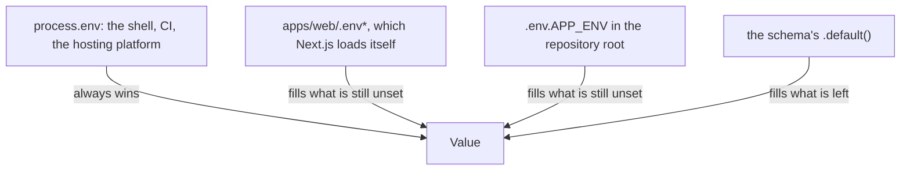

# 🌱 @repo/env

> One declaration per environment variable: the file that fills it, its validation, `.env.example` and the Turborepo check all come from the same zod schema.


## 🧭 Table of contents

- [🎯 Purpose](#-purpose)
- [🗂️ Structure](#️-structure)
  - [Which file, and who wins](#which-file-and-who-wins)
  - [When it fails](#when-it-fails)
- [🚀 Usage](#-usage)
- [⌨️ Commands](#️-commands)
- [🧩 Extending](#-extending)
- [🔗 Related](#-related)

## 🎯 Purpose

Every variable the repository reads is declared once, as a key in a zod schema in this package. From that declaration:

- `loadEnv` loads the repository's root env file and validates the variables, reporting every problem at once;
- `pnpm env:emit` writes the root `.env.example`, and `pnpm env:check` fails when the committed file drifts from the schemas;
- `pnpm env:check:turbo` fails when `turbo.json` does not declare a variable, which Turborepo's strict mode would otherwise strip from every task without a word.

`apps/web` calls `loadEnv` from `next.config.ts`, before Next.js reads `process.env`, and hands the validated values to Next.js through the config's `env` option, so a schema default reaches the bundles too. That is the only importer: the environment is read where a process starts and passed on from there.

## 🗂️ Structure

| Path                                                           | Holds                                                                                           |
| -------------------------------------------------------------- | ----------------------------------------------------------------------------------------------- |
| [`src/index.ts`](./src/index.ts)                               | The public API: `loadEnv`, `loadEnvFile`, `activeAppEnv`, `findRepoRoot`, the shapes, the error |
| [`src/schemas/`](./src/schemas/)                               | One shape per area (`app.schema.ts` today) and the registry every reader uses                   |
| [`src/schemas/boolean-flag.ts`](./src/schemas/boolean-flag.ts) | The only accepted spellings for a flag: `true` and `false`                                      |
| [`src/loading/`](./src/loading/)                               | The walk up to the workspace root, and the root env file loader                                 |
| [`src/validation/`](./src/validation/)                         | `loadEnv` and the error that lists every problem without printing a value                       |
| [`src/example/`](./src/example/)                               | Renders and writes `.env.example`                                                               |
| [`src/is-required.ts`](./src/is-required.ts)                   | The one required-or-optional test the emitter uses                                              |
| [`scripts/`](./scripts/)                                       | The command-line entry points behind `env:emit` and `env:check:turbo`                           |

### Which file, and who wins

`APP_ENV` names the file and defaults to `dev`: the file is `.env.<APP_ENV>` **in the repository root**, not one per workspace. Turborepo runs each task from the workspace folder, so the root is found by walking up to `pnpm-workspace.yaml`.



`process.loadEnvFile` never overwrites a variable that is already set, which gives that order and makes a second call harmless. Neither a missing root nor a missing file is an error: on a hosting platform the variables are injected and no file exists. `APP_ENV` has to be a plain name (`dev`, `staging`, `production`), so it cannot point outside the root.

> [!IMPORTANT]
> An empty value counts as unset, everywhere. CI passes a secret it does not have as an empty string, and a file copied from `.env.example` has empty values. `loadEnv` removes such variables from `process.env`, so an optional variable validates, the root file can fill what the shell left empty, and libraries see the value as missing.

### When it fails

Validation reports every problem at once and never prints a value, because the message reaches build logs and screenshots:

```text
Invalid environment (APP_ENV=dev, no file found)

  NEXT_PUBLIC_SITE_URL  not a valid url

1 problem. See .env.example at the repository root for the full contract.
```

## 🚀 Usage

```ts
import { appEnv, loadEnv } from "@repo/env";

const env = loadEnv(appEnv);

env.NEXT_PUBLIC_SITE_URL; // "http://localhost:3000" unless the shell or the root file sets it
```

`.env.example` lists what somebody has to supply, grouped by the schema titles, with no values:

```dotenv
# App
NEXT_PUBLIC_SITE_URL=
```

A variable with a default stays out of the file (it is a knob, and its default lives in the schema), unless its metadata says `requiredWhenDeployed`. `NEXT_PUBLIC_SITE_URL` is that case: its default is the local server, which is wrong in every deployment, so the file lists it. Set it wherever the app is deployed; left at the default, relative Open Graph and canonical URLs resolve against `localhost`.

## ⌨️ Commands

| Command                | Where        | What it does                                              |
| ---------------------- | ------------ | --------------------------------------------------------- |
| `pnpm env:emit`        | root         | Regenerates the root `.env.example` from the schemas      |
| `pnpm env:check`       | root         | Regenerates it and fails if the committed file differs    |
| `pnpm env:check:turbo` | root         | Fails if `turbo.json` leaves a schema variable undeclared |
| `pnpm test`            | this package | Vitest                                                    |
| `pnpm lint`            | this package | ESLint                                                    |
| `pnpm types:check`     | this package | TypeScript                                                |

## 🧩 Extending

A new variable is a new key in a schema, and then:

1. Add it to the shape that owns its area (or add a shape and register it in `src/schemas/index.ts` with its title).
2. `pnpm env:emit` and commit the new `.env.example`. Never edit that file by hand: the next run undoes it.
3. Declare it in `turbo.json`: `globalEnv` for a value that changes the build output, `globalPassThroughEnv` for a secret, which then stays out of every task hash. `pnpm env:check:turbo` fails until you do.
4. Read it through `loadEnv` where the process starts (`next.config.ts` for the web app) and pass the value on, rather than importing this package deeper in the code. A `NEXT_PUBLIC_` name needs no step of its own: the config builds its `env` map from the names the schema has.

- **Optional vs required**: `.optional()` or `.default()` only when the app really runs without the variable. When a default fits a developer's machine but every deployment needs its own value, keep the default and add `.meta({ requiredWhenDeployed: true })`.
- **A flag** uses `booleanFlag("false")`: `z.coerce.boolean()` reads the string `"false"` as true.
- **Metadata goes last**: zod drops `.meta()` attached before a `.transform()`.

## 🔗 Related

- [Feature-Sliced Design](../../docs/architecture/feature-sliced-design.md): where a new integration's keys and code go
- [turbo.json](../../turbo.json): the env declarations `env:check:turbo` reads
