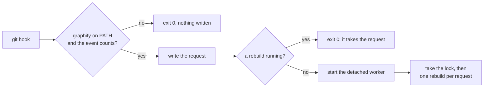

# 🧠 Graph scripts

> The scripts that keep the code graph and its Obsidian notes in step with the checkout, in the background.

## 🎯 Purpose

[graphify](https://github.com/rhanka/graphify) reads this repository into a queryable graph. Keeping that graph current by hand means remembering to rebuild it after every commit, branch switch and pull, so these scripts do it from the git hooks instead. They answer to three rules: a machine without graphify notices nothing, git never waits and never fails because of them, and two rebuilds never run at the same time.

[Knowledge graph](../../../docs/knowledge/README.md) is the guide for whoever uses the graph. This README is for whoever changes these scripts.

## 🗂️ Structure

| File                | Holds                                                                                                      |
| ------------------- | ---------------------------------------------------------------------------------------------------------- |
| `graph-rules.mjs`   | Which hook events call for a rebuild, the graphify commands, and finding graphify on the PATH. No state    |
| `graph-lock.mjs`    | The request file and the lock, both under `.graphify/`                                                     |
| `graph-rebuild.mjs` | The command: the hook trigger, the detached worker it starts, and the rebuild by hand                      |
| `graph-hint.mjs`    | A Claude Code `PreToolUse` hook: before a search, points at the graph. Declared in `.claude/settings.json` |

## 🚀 Usage

### The three modes

```bash
node tooling/scripts/graphify/graph-rebuild.mjs post-commit          # what lefthook runs
node tooling/scripts/graphify/graph-rebuild.mjs --worker             # the detached rebuild
node tooling/scripts/graphify/graph-rebuild.mjs                      # pnpm graph, in the foreground
```

The trigger writes a request, and starts the worker unless one is already running. The worker takes the lock and rebuilds once per request, so hooks that fire while a rebuild runs add one more rebuild, never a second at the same time.



### Three things that will bite

- **The worker must keep no terminal.** It is started detached and with `stdio: "ignore"`; with the streams inherited, lefthook waits for the pipes to close and a commit takes as long as the rebuild (a test measures both).
- **The lock is graphify's own.** `.graphify/.rebuild.lock` is the file `graphify watch` takes around its rebuilds, in its format: the owner's process id on the first line. That is how a hook rebuild and a watching terminal stay out of each other's way. A lock counts as abandoned when its process is gone or when its heartbeat stopped ten minutes ago.
- **git variables do not travel.** Git exports `GIT_INDEX_FILE` and friends to its hooks, and graphify runs git to read the history, so the worker starts from an environment without them.

## ⌨️ Commands

| Command                                                            | What it does                            |
| ------------------------------------------------------------------ | --------------------------------------- |
| `pnpm graph`                                                       | Rebuilds now, in the foreground         |
| `pnpm graph:watch`                                                 | Rebuilds the graph on every code change |
| `echo '<payload>' \| node tooling/scripts/graphify/graph-hint.mjs` | Runs the graph hint on one payload      |

## 🧩 Extending

- **A new trigger** is a hook key in [`lefthook.yml`](../../../lefthook.yml) with a `graph` job that calls the script with `{0}`, plus its case in `EVENTS` in `graph-rules.mjs`, which is the list the trigger reads.
- **A change to the rebuild itself** belongs in `REBUILD_STEPS`, one array of arguments per step, run in order until one fails. The steps carry `--force`, `--no-description` and `--no-label` for the reasons written next to them.
- **Slow or hung rebuilds** are bounded by the step timeout, after which the lock is freed rather than held for good.

## 🔗 Related

- [Knowledge graph](../../../docs/knowledge/README.md): what the graph holds, how to read it, and how to turn it off
- [Obsidian setup](../../../docs/knowledge/obsidian-setup.md): opening the repository as a vault
- [@repo/scripts](../README.md): the other checks lefthook and CI run
- [Claude Code hooks](../claude-hooks/README.md): the hooks that run around Claude's tool calls
