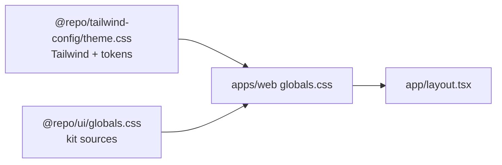

# 🎨 @repo/tailwind-config

> The Tailwind CSS entry point, the design tokens and the PostCSS config, shared by every app and UI package.


## 🎯 Purpose

Colors, radius and fonts are defined once, in `theme.css`, and every workspace reads them from there: the web app builds its stylesheet from it, the UI kit's components are styled with its utilities, and the shadcn CLI writes the variables of new components into it. Tailwind v4 is configured in CSS, so this package is a stylesheet and a PostCSS config, with no JavaScript preset.

## 🗂️ Structure

| File                                       | Export                                 | Holds                                                                                                                                                                                       |
| ------------------------------------------ | -------------------------------------- | ------------------------------------------------------------------------------------------------------------------------------------------------------------------------------------------- |
| [`theme.css`](./theme.css)                 | `@repo/tailwind-config/theme.css`      | `@import "tailwindcss"`, `tw-animate-css` and the shadcn variants; the `dark` variant; the token values (`:root` and `.dark`, OKLCH); the `@theme inline` mapping to utilities; base styles |
| [`postcss.config.js`](./postcss.config.js) | `@repo/tailwind-config/postcss-config` | The PostCSS config with `@tailwindcss/postcss`                                                                                                                                              |

The tokens follow the shadcn/ui naming: every color is a pair, `--name` for the surface and `--name-foreground` for the text on it, mapped to utilities such as `bg-primary` and `text-primary-foreground`. [DESIGN.md](../../DESIGN.md) lists every value and when to use it.

## 🚀 Usage

An app's PostCSS config re-exports this one:

```js
// apps/web/postcss.config.mjs
export { default } from "@repo/tailwind-config/postcss-config";
```

The app's global stylesheet imports the theme first, then the stylesheet of each UI package, then registers its own source folders:

```css
/* apps/web/src/_app/styles/globals.css */
@import "@repo/tailwind-config/theme.css";
@import "@repo/ui/globals.css";

@source "../../**/*.{ts,tsx}";
@source "../../../app/**/*.{ts,tsx}";
```



> [!IMPORTANT]
> The theme imports Tailwind with `source(none)`, so Tailwind scans only the folders that each stylesheet registers with `@source`. A new folder with components needs its own `@source` line, or its classes produce no CSS.

The app declares `@repo/tailwind-config` in its `devDependencies`. The shadcn CLI finds the tokens through the `tailwind.css` field of each `components.json`, which points at `theme.css`.

## ⌨️ Commands

| Command                                           | What it does                                |
| ------------------------------------------------- | ------------------------------------------- |
| `pnpm --filter @repo/tailwind-config lint`        | ESLint on the PostCSS config                |
| `pnpm --filter @repo/tailwind-config format`      | Prettier check on the stylesheet and config |
| `pnpm --filter @repo/tailwind-config spell:check` | cspell                                      |

## 🔁 How it updates

- `pnpm dlx shadcn@latest add <component>`, run from `apps/web`, adds the CSS variables the component needs to `theme.css`.
- `pnpm dlx shadcn@latest apply --only theme <preset>` replaces the token values with those of another shadcn preset.
- Tailwind, `tw-animate-css` and `shadcn` versions come from the `catalog` of `pnpm-workspace.yaml`.

## 🧩 Extending

- **Add a token**: define `--name` in `:root` and in `.dark`, map it in `@theme inline` (`--color-name: var(--name);`), then use `bg-name` or `text-name`. Document it in [DESIGN.md](../../DESIGN.md) in the same change.
- **Change the brand**: edit the values in `:root` and `.dark`, and `--radius`. Keep each `-foreground` value readable on its surface; `npx -y @google/design.md@0.4.0 lint DESIGN.md` checks the contrast of the documented pairs.
- **Add a UI package**: give it a stylesheet that registers its files with `@source`, and import it from each app's global stylesheet after the theme.

## 🔗 Related

- [DESIGN.md](../../DESIGN.md): the design system, value by value
- [@repo/ui](../../packages/ui/README.md): the components built on these tokens
- [Tailwind CSS: detecting classes in source files](https://tailwindcss.com/docs/detecting-classes-in-source-files)
